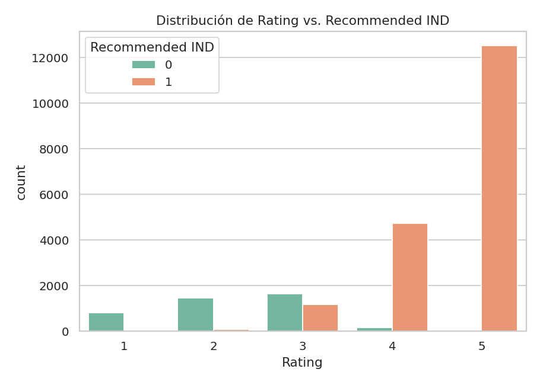
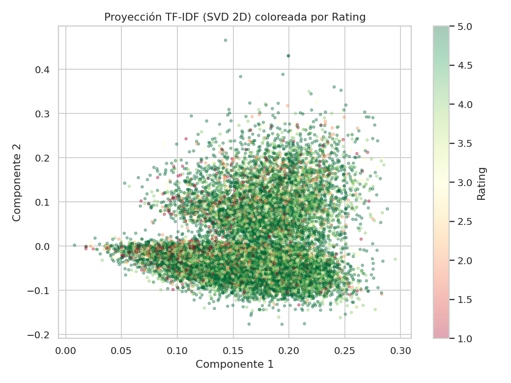
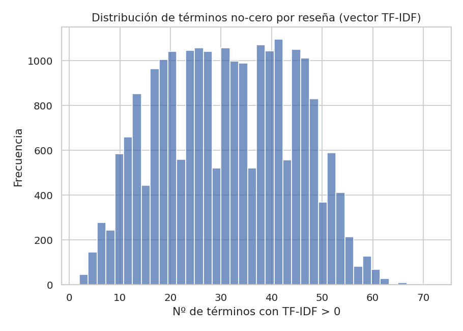
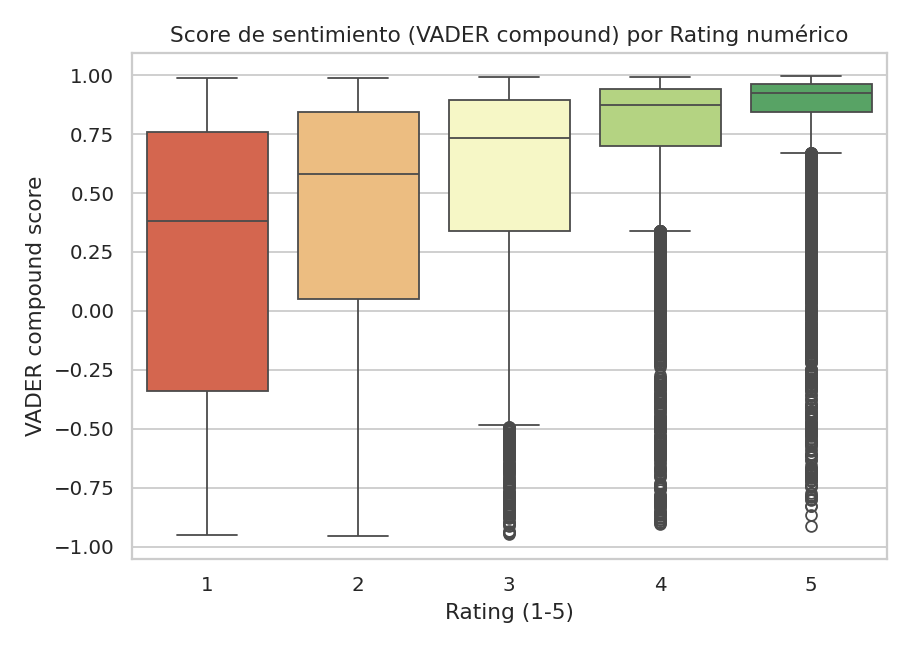
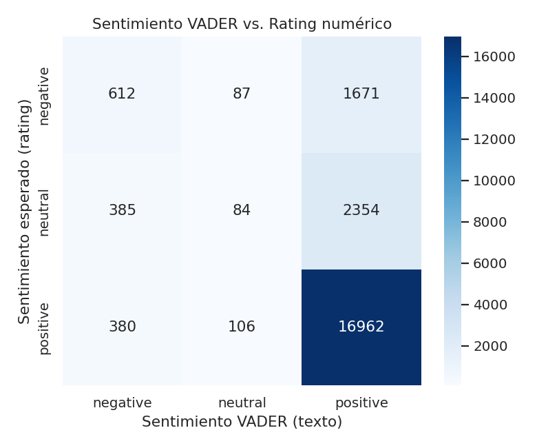

\newpage

# 1. Introducción y objetivo

El objetivo de este trabajo es aplicar un pipeline completo de procesamiento de lenguaje natural sobre
un conjunto de datos de reseñas de usuarios, cubriendo tres etapas: (1) selección y vectorización del
texto, (2) estudio de las propiedades del espacio vectorial resultante, y (3) análisis de sentimiento
sobre el texto de la reseña, contrastado contra la calificación numérica (`Rating`) asignada por el
mismo usuario.

# 2. Conjunto de datos

Se utilizó el dataset público **Women's Clothing E-Commerce Reviews**, que contiene **23,486 reseñas**
reales de e-commerce de ropa femenina, anonimizadas (las referencias al retailer fueron reemplazadas por
"retailer"). Tras eliminar registros sin texto de reseña, quedaron **22,641 reseñas** utilizables. Las
variables relevantes para este análisis son:

| Variable | Descripción |
|---|---|
| `Review Text` | Texto libre de la reseña (2 a 115 palabras, media aprox. 60) |
| `Rating` | Calificación entera de 1 (peor) a 5 (mejor) otorgada por la clienta |
| `Recommended IND` | Variable binaria: 1 si recomienda el producto, 0 si no |

La distribución de `Rating` está fuertemente sesgada hacia calificaciones altas: el 55% de las reseñas
tiene calificación 5 y solo el 3.6% tiene calificación 1, un patrón típico de autoselección en
plataformas de e-commerce (clientes satisfechos dejan reseña con mayor frecuencia).

{width=85%}

# 3. Metodología

## 3.1 Preprocesamiento de texto

Sobre `Review Text` se aplicó el siguiente pipeline antes de vectorizar:

1. Conversión a minúsculas.
2. Eliminación de caracteres no alfabéticos (se preservan apóstrofes para no romper contracciones).
3. Tokenización con NLTK (`word_tokenize`).
4. Eliminación de *stopwords* del inglés.
5. Lematización (`WordNetLemmatizer`).
6. Filtro de tokens con longitud menor a 3 caracteres.

Ejemplo:

> **Original:** *"Love this dress! it's sooo pretty. i happened to find it in a store, and i'm glad i did
> bc i never would have ordered it online bc it's petite..."*
>
> **Preprocesado:** *"love dress sooo pretty happened find store glad never would ordered online petite
> bought petite love length hit little knee would definitely true midi..."*

## 3.2 Vectorización: TF-IDF

Se eligió **TF-IDF** (Term Frequency – Inverse Document Frequency) como método de vectorización. La
justificación de esta elección frente a alternativas (bag-of-words simple, embeddings densos tipo
Word2Vec/GloVe) es:

- El corpus está compuesto por documentos **cortos** (~60 palabras) sobre un dominio semántico
  relativamente acotado (ropa, tallas, tela), donde ponderar los términos por su rareza en el corpus
  (IDF) aporta más señal discriminativa que la sola frecuencia (TF).
- **Interpretabilidad**: permite inspeccionar directamente qué términos dominan cada nivel de rating,
  algo que embeddings densos entrenados no ofrecen de forma directa en un análisis exploratorio.
- Es una entrada natural y eficiente para modelos lineales de contraste (regresión logística).

Configuración utilizada: `TfidfVectorizer(max_features=5000, min_df=5, max_df=0.85, ngram_range=(1,2))`,
es decir, unigramas y bigramas, vocabulario limitado a 5,000 términos, descartando términos que aparecen
en menos de 5 documentos o en más del 85% del corpus, con normalización L2 (por defecto en scikit-learn).

## 3.3 Análisis de sentimiento

Se utilizó **VADER** (Valence Aware Dictionary and sEntiment Reasoner), un analizador de sentimiento
basado en léxico diseñado específicamente para texto informal (maneja bien mayúsculas, puntuación e
intensificadores como "!!!" o "very"). A diferencia del texto usado para TF-IDF, VADER se aplicó sobre
el texto **original** (sin preprocesar), ya que eliminar mayúsculas y puntuación le hace perder señal.

VADER produce un score compuesto (`compound`) en el rango [-1, 1]. Se utilizó el umbral estándar de la
librería para clasificar cada reseña:

- `compound >= 0.05` → **positivo**
- `compound <= -0.05` → **negativo**
- en otro caso → **neutral**

Para comparar contra el `Rating` numérico, se definió una etiqueta "esperada" por calificación:
`Rating <= 2 → negativo`, `Rating = 3 → neutral`, `Rating >= 4 → positivo`.

\newpage

# 4. Resultados

## 4.1 Propiedades del espacio vectorial TF-IDF

| Métrica | Valor |
|---|---|
| Documentos | 22,641 |
| Dimensión del vocabulario | 5,000 |
| Elementos no-cero | 704,164 |
| **Sparsity** (proporción de ceros) | **99.38%** |
| Términos no-cero promedio por reseña | 31.1 (mediana 31) |
| Varianza explicada por 50 componentes SVD (LSA) | 12.4% |

La matriz resultante es, como es esperable en representaciones bag-of-words, **extremadamente dispersa**
(>99% de sus entradas son cero): cada reseña activa en promedio solo 31 de las 5,000 dimensiones
posibles. Esto confirma la llamada "maldición de la dimensionalidad" propia de TF-IDF: los vectores
viven en un espacio de alta dimensión donde la mayoría de pares de documentos son casi ortogonales entre
sí. En una muestra de 300 reseñas, la similitud coseno promedio entre pares con el **mismo** rating fue
de 0.0297, prácticamente igual a la similitud promedio entre pares de rating **distinto** (0.0285) — es
decir, a nivel de vector completo la similitud bruta no separa bien por rating, y la señal relevante
está distribuida en combinaciones de muchos términos más que concentrada en unas pocas dimensiones
(consistente con que 50 componentes de SVD expliquen apenas ~12% de la varianza total).

**Términos con IDF más bajo** (más comunes en el corpus, por lo tanto con menor peso individual):
`fit`, `love`, `size`, `dress`, `color`, `like`, `top`, `look`, `wear`, `great` — vocabulario genérico
del dominio de ropa presente en casi toda reseña.

**Términos con IDF más alto** (más raros / específicos): bigramas y términos poco frecuentes como
`low rise`, `dry cleaned`, `elastic band`, `extra large` — aportan señal específica cuando aparecen.

**Vocabulario dominante por nivel de Rating** (promedio de TF-IDF por grupo):

| Rating | Términos dominantes |
|---|---|
| 1  | dress, like, look, top, fabric, back, shirt, material, would, **disappointed** |
| 2  | dress, like, would, top, look, back, fabric, size, fit, shirt |
| 3  | dress, top, like, would, look, size, fit, fabric, small, color |
| 4  | dress, size, top, fit, like, **great**, **love**, little, color, look |
| 5  | **love**, dress, fit, **great**, size, top, color, wear, **perfect**, look |

Se observa una transición clara: en ratings bajos aparecen términos de queja (*disappointed*) y
descriptivos neutros, mientras que en ratings altos dominan términos claramente positivos (*love*,
*great*, *perfect*). Esto confirma que, pese a la alta dispersión y ortogonalidad general del espacio,
TF-IDF sí captura información asociada a la satisfacción del cliente a nivel agregado.

{width=80%}

{width=75%}

\newpage

## 4.2 Sentimiento del texto vs. calificación numérica

La distribución de sentimiento detectado por VADER sobre las 22,641 reseñas fue:

| Sentimiento (VADER) | Nº reseñas | % |
|---|---|---|
| Positivo | 20,987 | 92.7% |
| Negativo | 1,377 | 6.1% |
| Neutral | 277 | 1.2% |

**Correlación con el Rating numérico:**

- Pearson r = **0.4655** (p < 0.001)
- Spearman rho = **0.4271** (p < 0.001)

Ambas correlaciones son positivas y de magnitud moderada: confirman que el sentimiento del texto y la
calificación explícita están relacionados, pero distan de ser redundantes (r^2 aprox. 0.22, es decir, el
sentimiento del texto solo explica ~22% de la varianza del rating numérico).

El score `compound` promedio **crece de forma monótona** con el rating:

| Rating | Compound promedio | Desv. estándar |
|---|---|---|
| 1 | 0.208 | 0.598 |
| 2 | 0.400 | 0.527 |
| 3 | 0.539 | 0.465 |
| 4 | 0.744 | 0.331 |
| 5 | 0.853 | 0.213 |

{width=75%}

Al clasificar cada reseña en {negativo, neutral, positivo} y comparar contra la etiqueta esperada según
el rating, la **exactitud global es de 77.99%**. La matriz de confusión revela dónde está el error:

{width=70%}

De las 2,370 reseñas con rating bajo (esperado = *negativo*), VADER solo clasifica correctamente 612
como negativas (25.8%) y etiqueta 1,671 (70.5%) como **positivas**. El error es mucho menor en el otro
sentido: de las 19,271 reseñas con rating alto (esperado = *positivo*), 16,962 (88%) sí son detectadas
correctamente como positivas.

**Interpretación:** las clientas insatisfechas suelen redactar reseñas de tono mixto — elogian algún
aspecto del producto (diseño, tela) mientras explican el motivo puntual de su insatisfacción (talla,
color, terminado) — lo que hace que el balance léxico global de la reseña resulte positivo aun cuando el
rating otorgado es bajo. Esta es una limitación conocida del *sentiment analysis* basado en léxico frente
a una calificación explícita, que sintetiza en un solo número una decisión de compra completa
(incluyendo factores no verbalizados en el texto).

## 4.3 Modelo supervisado de contraste

Para contextualizar qué tanto del espacio TF-IDF es aprovechable si se dispone de una etiqueta de
entrenamiento, se ajustó una regresión logística (con balanceo de clases) sobre la matriz TF-IDF para
predecir `Recommended IND` (80/20 train/test):

| Métrica | Valor |
|---|---|
| Accuracy | 0.8675 |
| F1-score | 0.9155 |

Este modelo supervisado supera claramente al enfoque de sentimiento léxico no supervisado (86.8% vs.
78.0% de exactitud frente a sus respectivas variables objetivo), evidenciando que el espacio vectorial
TF-IDF contiene información suficiente para predecir la satisfacción del cliente con buena precisión
cuando se cuenta con una señal de entrenamiento, más allá de lo que puede capturar un léxico de
sentimiento genérico no adaptado al dominio de reseñas de ropa.

\newpage

# 5. Conclusiones

1. **TF-IDF** resultó un método de vectorización adecuado e interpretable para este corpus de reseñas
   cortas: el vocabulario de mayor peso por nivel de rating permite trazar directamente la transición de
   quejas a elogios a medida que sube la calificación.

2. El espacio vectorial obtenido es **altamente disperso** (99.38% de ceros) y de alta dimensionalidad
   efectiva distribuida (31 términos activos en promedio de 5,000 posibles); la similitud coseno bruta
   entre documentos no separa bien por rating, y 50 componentes de SVD solo explican ~12% de la
   varianza — la señal relevante está repartida en combinaciones de muchos términos, no concentrada en
   pocas direcciones dominantes.

3. El **sentimiento del texto (VADER)** y la **calificación numérica explícita** están correlacionados
   de forma moderada (r aprox. 0.47) pero no son intercambiables: el análisis léxico sub-detecta
   sistemáticamente el descontento en reseñas de rating bajo (miss rate aprox. 70% en la clase negativa)
   porque el texto suele mezclar elogios parciales con la queja específica.

4. Un **modelo supervisado** simple (regresión logística) entrenado sobre el mismo espacio TF-IDF, pero
   aprovechando la etiqueta disponible (`Recommended IND`), alcanza una exactitud considerablemente
   mayor (86.8%) que el enfoque de sentimiento basado en léxico (78.0%), lo que sugiere que, cuando se
   dispone de calificaciones históricas, conviene usarlas como señal de entrenamiento en lugar de
   depender únicamente de heurísticas de sentimiento genéricas.

# 6. Referencias

- Dataset: *Women's Clothing E-Commerce Reviews*, disponible en
  https://github.com/AFAgarap/ecommerce-reviews-analysis (réplica de un dataset originalmente publicado
  en Kaggle).
- Hutto, C.J. & Gilbert, E. (2014). *VADER: A Parsimonious Rule-based Model for Sentiment Analysis of
  Social Media Text*. Eighth International Conference on Weblogs and Social Media (ICWSM-14).
- Pedregosa, F. et al. (2011). *Scikit-learn: Machine Learning in Python*. JMLR 12, pp. 2825-2830.
