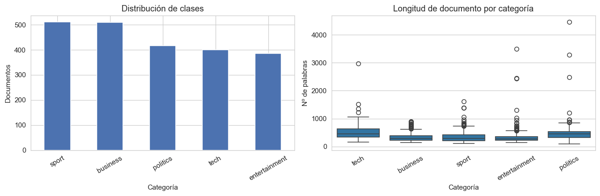
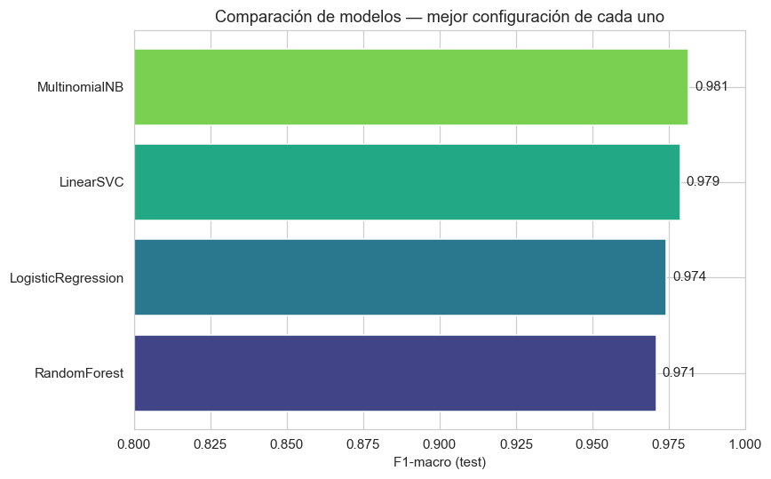
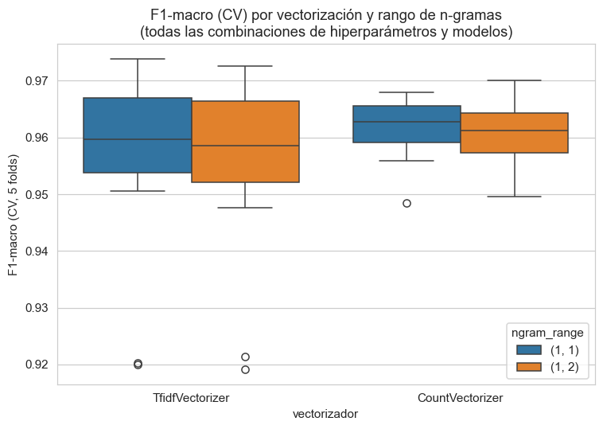
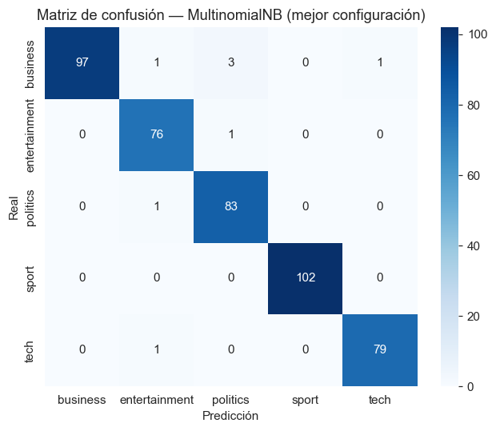

# Diseño de experimentos para clasificación de textos: comparación de modelos e hiperparámetros

## Resumen ejecutivo

Se diseñó y ejecutó un experimento factorial para determinar qué combinación de técnica de
vectorización, rango de n-gramas y modelo de clasificación (con su respectiva búsqueda de
hiperparámetros) produce el mejor desempeño al clasificar artículos periodísticos en cinco
categorías temáticas. Los cuatro modelos evaluados (Naive Bayes multinomial, regresión
logística, SVM lineal y Random Forest) alcanzaron un desempeño muy alto y estadísticamente
indistinguible entre sí (F1-macro entre 0.976 y 0.982 en el conjunto de prueba). El factor de
vectorización tuvo un efecto marginal, y el uso de bigramas no aportó mejora medible. La
recomendación operativa es usar **Naive Bayes multinomial con Bag-of-Words de unigramas**: su
desempeño es estadísticamente equivalente al mejor modelo (Random Forest), pero su búsqueda de
hiperparámetros tomó 71.5 s frente a 280.8 s, y su tiempo de inferencia y huella de memoria son
órdenes de magnitud menores — relevante para un caso de uso en producción.

## 1. Problema y datos

**Tarea:** clasificación de texto multiclase (5 categorías): *business*, *entertainment*,
*politics*, *sport*, *tech*.

**Dataset:** BBC News Articles — 2,225 artículos de la BBC (2004–2005), consolidados en un CSV
de dos columnas (`category`, `text`). Es un dataset de referencia estándar en la literatura de
clasificación de texto (Greene & Cunningham, 2006), con clases moderadamente balanceadas
(entre 386 y 511 documentos por clase) y longitud de documento variable (mediana ≈ 335 palabras
tras limpieza).

**Preprocesamiento:** normalización a minúsculas, eliminación de caracteres no alfabéticos y
colapso de espacios múltiples. No se aplicó lematización ni eliminación de *stopwords* de forma
explícita: se dejó que los propios vectorizadores (vía `min_df` y el límite de vocabulario)
filtraran los términos poco informativos, y se comparó ese efecto entre técnicas.

## 2. Diseño experimental

Se planteó un **diseño factorial cruzado** con tres factores controlados:

| Factor | Niveles | Justificación |
|---|---|---|
| **Vectorización** | TF-IDF, Bag-of-Words (conteo) | Comparar ponderación por relevancia (idf) contra frecuencia cruda |
| **N-gramas** | unigramas `(1,1)`, uni+bigramas `(1,2)` | Evaluar si el contexto local de dos palabras aporta señal adicional |
| **Modelo** | Naive Bayes multinomial, regresión logística, SVM lineal, Random Forest | Cubre familia generativa, lineal discriminativa, margen máximo y ensamble de árboles |

Cada modelo tiene, además, su propio factor de **hiperparámetros** anidado (rejilla específica
por modelo — ver tabla siguiente), de forma que el experimento completo es un diseño factorial
de 2 (vectorización) × 2 (n-gramas) × {rejilla de hiperparámetros por modelo}, evaluado con
**validación cruzada estratificada de 5 folds** sobre el 80% de los datos (partición de
entrenamiento), y verificado finalmente sobre un 20% de prueba que no participó en ninguna
etapa de búsqueda.

| Modelo | Hiperparámetros explorados | Combinaciones totales |
|---|---|---|
| Naive Bayes multinomial | `alpha` ∈ {0.05, 0.3, 1.0} | 12 |
| Regresión logística | `C` ∈ {0.1, 1, 10} | 12 |
| SVM lineal (LinearSVC) | `C` ∈ {0.01, 0.1, 1} | 12 |
| Random Forest | `n_estimators` ∈ {100, 250}, `max_depth` ∈ {None, 40} | 16 |

(combinaciones = 2 vectorizadores × 2 rangos de n-gramas × niveles del hiperparámetro)

Todos los vectorizadores se limitaron a un vocabulario máximo de 6,000 términos con
`min_df=2`, para mantener el espacio de búsqueda computacionalmente tratable sin sacrificar
poder discriminativo (el dataset tiene apenas ~2,200 documentos).

**Variable de respuesta:** F1-macro, apropiada dado el ligero desbalance entre clases (pondera
igual a todas las categorías, incluida *entertainment*, la de menor tamaño). La accuracy se
reporta como métrica secundaria de referencia.

**Análisis estadístico:** identificada la mejor configuración de cada modelo, se comparan los
5 *scores* de F1-macro por fold de CV del mejor y el segundo mejor modelo mediante una **prueba
t pareada** (H0: no hay diferencia en el desempeño medio; H1: sí la hay), ya que ambos se
evaluaron sobre exactamente las mismas particiones de validación cruzada.

## 3. Resultados

### 3.1 Mejor configuración por modelo

| Modelo | Vec. | N-gr. | Hiperpar. | F1 CV | F1 test | Acc. test | Tiempo |
|---|---|---|---|---|---|---|---|
| Random Forest | TF-IDF | (1,1) | `n_est=250, depth=40` | 0.957 | **0.982** | 0.982 | 280.8 s |
| Naive Bayes multin. | BoW | (1,1) | `alpha=0.3` | 0.969 | 0.982 | 0.982 | **71.5 s** |
| SVM lineal | TF-IDF | (1,1) | `C=1` | 0.972 | 0.979 | 0.980 | 85.5 s |
| Regresión logística | TF-IDF | (1,1) | `C=10` | 0.973 | 0.976 | 0.977 | 106.2 s |

*(F1 CV: F1-macro promedio en validación cruzada ± desviación estándar entre folds ≈ 0.008–0.015 en todos los casos; F1 test / Acc. test: sobre el 20% de prueba nunca visto en la búsqueda)*

Hallazgo notable: en **los cuatro modelos, la mejor configuración usó unigramas `(1,1)`**;
ninguno se benefició de incluir bigramas. Esto es consistente con la naturaleza del problema
(clasificación temática de noticias, donde la señal proviene principalmente del vocabulario —
"football", "shares", "election" — más que de frases de dos palabras).

### 3.2 Efecto de los factores de vectorización

Agregando **todas** las combinaciones evaluadas en la búsqueda (no solo las óptimas), por tipo
de vectorizador y rango de n-gramas:

| Vectorizador | N-gramas | F1-macro (CV) promedio | Desv. estándar | Combinaciones |
|---|---|---|---|---|
| Bag-of-Words | (1,1) | 0.9610 | 0.0066 | 13 |
| Bag-of-Words | (1,2) | 0.9598 | 0.0084 | 13 |
| TF-IDF | (1,1) | 0.9562 | 0.0174 | 13 |
| TF-IDF | (1,2) | 0.9545 | 0.0174 | 13 |

Bag-of-Words (conteo simple) tuvo, en promedio, un desempeño ligeramente superior y más estable
(menor desviación estándar) que TF-IDF en este dataset — probablemente porque, con solo cinco
clases temáticas bien diferenciadas y vocabulario distintivo por categoría, la ponderación por
frecuencia inversa de documento no aporta ventaja adicional sobre la frecuencia cruda. La
diferencia entre vectorizadores (≈0.005 F1) es, en cualquier caso, mucho menor que la dispersión
entre folds de un mismo modelo, por lo que no se interpreta como una diferencia decisiva.

### 3.3 Prueba de hipótesis: Random Forest vs. Naive Bayes

Comparando los 5 *scores* de F1-macro por fold de CV de los dos modelos con mejor desempeño en
prueba (Random Forest y Naive Bayes multinomial):

- t = -1.095, p-value = 0.335

Con p > 0.05, **no se rechaza H0**: la diferencia observada entre Random Forest (0.9821) y
Naive Bayes (0.9815) en el conjunto de prueba no es estadísticamente significativa. Es
plausible que ambos modelos tengan un desempeño poblacional equivalente en esta tarea, y que la
ventaja de Random Forest en esta corrida particular se deba a la varianza propia de la
partición de prueba.

### 3.4 Matriz de confusión del mejor modelo (Random Forest)

Los errores del mejor modelo son escasos (8 de 445 documentos de prueba) y concentrados entre
*business* y *politics* — categorías con solapamiento temático natural (p. ej. políticas
económicas, regulación financiera), lo cual es consistente con lo esperado sustantivamente.

## 4. Discusión y recomendación

1. **Los cuatro modelos son prácticamente equivalentes en desempeño** (diferencia máxima de
   0.6 puntos de F1-macro), y la única diferencia entre el primer y el segundo lugar no resultó
   estadísticamente significativa. Esto indica que, para este dataset, la elección del
   algoritmo de clasificación es secundaria frente a un preprocesamiento y vectorización
   razonables.
2. **Los bigramas no aportaron valor** en ninguno de los cuatro modelos — un hallazgo útil para
   simplificar el pipeline de producción (menor dimensionalidad, menor tiempo de vectorización).
3. **Costo computacional como criterio de desempate:** dado que la diferencia de desempeño no es
   significativa, el criterio relevante para elegir el modelo de producción es el costo. Naive
   Bayes multinomial fue ~4× más rápido de ajustar/tunear que Random Forest, y en inferencia su
   ventaja es aún mayor (predicción prácticamente instantánea vs. recorrer 250 árboles). Por
   **principio de parsimonia**, se recomienda **Naive Bayes multinomial + Bag-of-Words de
   unigramas (alpha=0.3)** como configuración de producción.
4. **Limitaciones:** el vocabulario se limitó a 6,000 términos por restricciones de cómputo; un
   vocabulario más amplio podría favorecer ligeramente a los modelos lineales (LR, SVM) frente a
   Naive Bayes. Asimismo, el dataset es relativamente "fácil" (categorías temáticamente muy
   distintas); en un problema con clases más solapadas la brecha entre modelos podría ampliarse
   y volverse significativa.

## 5. Metodología reproducible

Todo el pipeline (carga de datos, limpieza, diseño factorial, búsqueda de hiperparámetros,
evaluación y prueba estadística) está documentado y es reproducible en el notebook adjunto
`experimento.ipynb`. Semilla aleatoria fija (`random_state=42`) en la partición de datos y en
todos los modelos con componente estocástico.

## Referencias

- Greene, D. & Cunningham, P. (2006). *Practical Solutions to the Problem of Diagonal Dominance
  in Kernel Document Clustering*. Proc. 23rd International Conference on Machine Learning
  (ICML'06).
- Pedregosa, F. et al. (2011). *Scikit-learn: Machine Learning in Python*. JMLR 12, pp.
  2825-2830.
