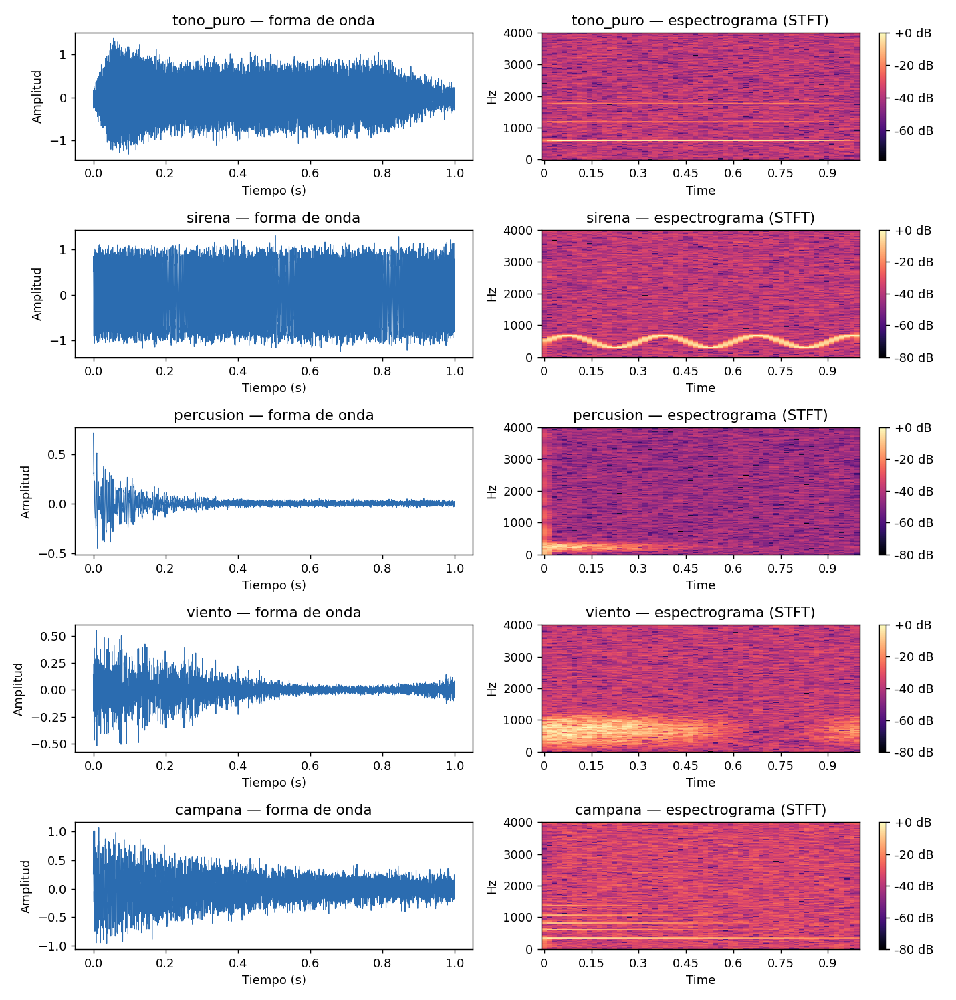
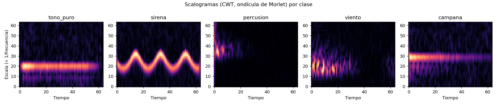
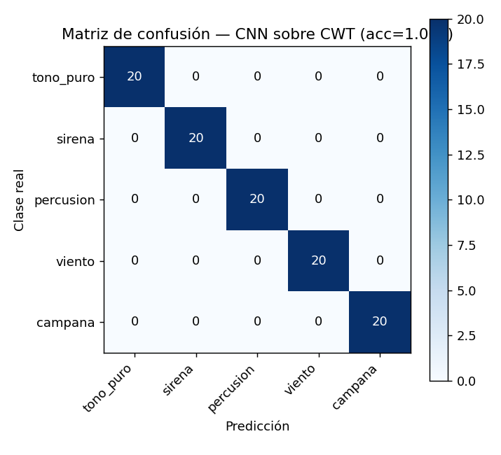
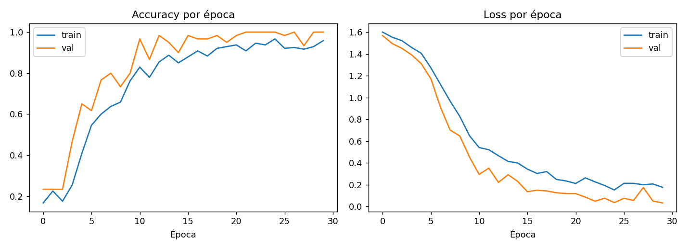
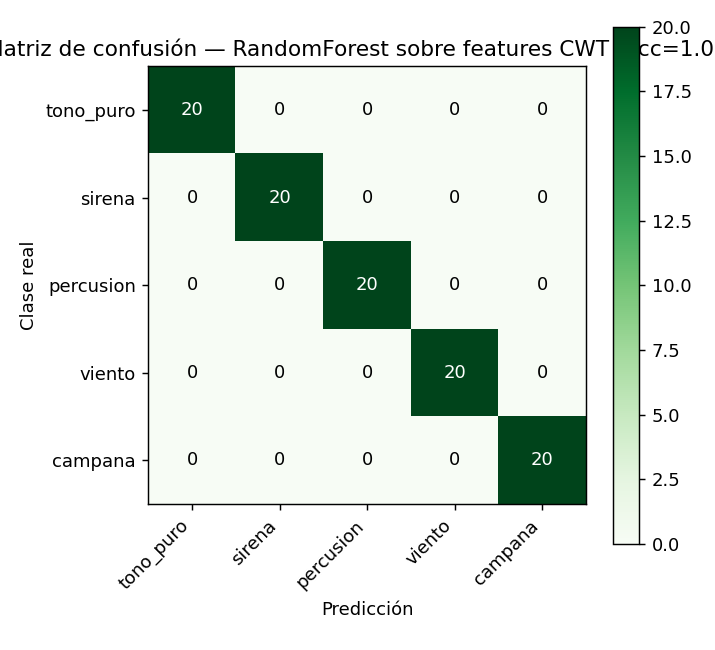
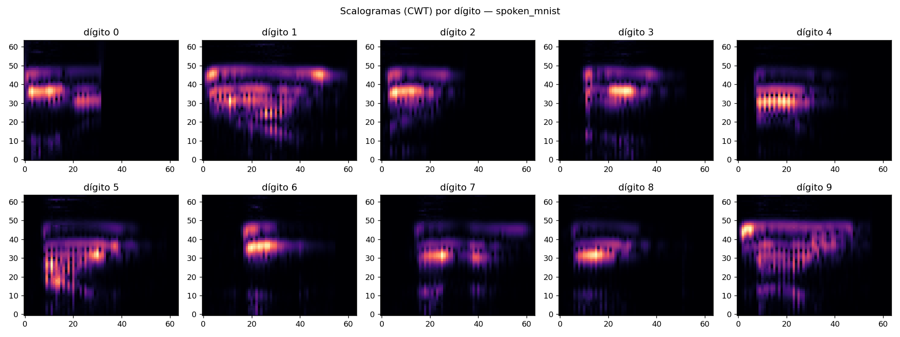
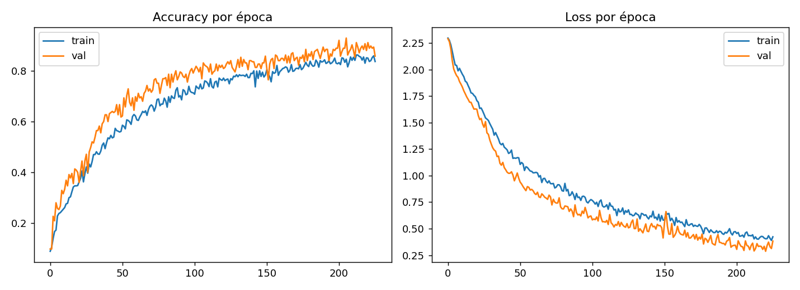
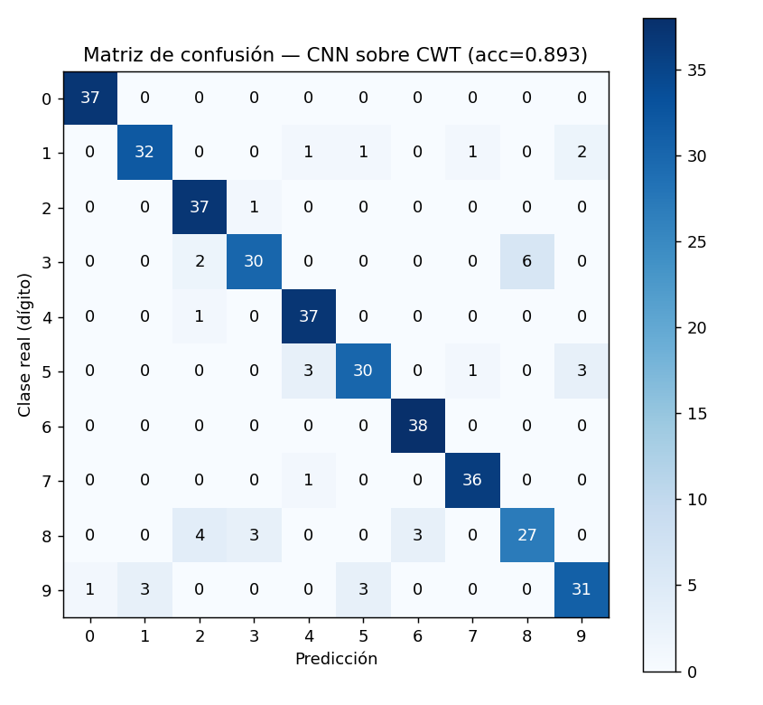

# Clasificación de audio mediante Transformada Wavelet Continua (CWT) y Deep Learning

**Maestría en Ciencia de Datos — UANL**
**Materia:** Procesamiento y clasificación de datos
**Tema:** Procesamiento de audio (Clase 7 y Clase 8)
**Autor:** Ferre

---

## 1. Objetivo

Implementar un pipeline de clasificación de audio a partir de ondículas (*wavelets*), siguiendo el enfoque de Dutt (2020)[^1], y comparar su desempeño contra un modelo clásico sobre features estadísticas derivadas de la misma transformada. El ejercicio integra los dos bloques de la unidad: representación y preprocesamiento de audio (Clase 7 — dominio tiempo/frecuencia, MFCC, espectrogramas) y análisis multirresolución con ondículas (Clase 8 — CWT, ondícula de Morlet).

El trabajo se dividió en dos experimentos complementarios:

1. **Prueba de concepto controlada** (secciones 2–5): dataset sintético de 5 clases acústicas diseñado para validar el pipeline completo (CWT → CNN, comparado contra un baseline de RandomForest) en condiciones conocidas y reproducibles en cualquier entorno, sin dependencias externas.
2. **Validación con audio real** (sección 6): el mismo pipeline aplicado al dataset de dígitos hablados usado en clase (`activeloop/spoken_mnist`[^2]), para probarlo en un problema genuinamente difícil (voz real, 10 clases) más allá del caso sintético.

[^1]: Dutt, A. (2020). *Audio Classification Using Wavelet Transform and Deep Learning*. https://adityadutt.medium.com/audio-classification-using-wavelet-transform-and-deep-learning-f9f0978fa246
[^2]: Activeloop. *spoken_mnist* dataset. https://datasets.activeloop.ai/docs/ml/datasets/spoken-mnist-dataset/

## 2. Datos — experimento sintético

El entorno de ejecución usado para el desarrollo inicial de este pipeline no tenía salida a internet, por lo que el dataset real de clase (`activeloop/spoken_mnist`) no era accesible ahí. En vez de bloquear el ejercicio, se generó un **dataset sintético de audio con 5 clases acústicas** claramente diferenciables en el plano tiempo-frecuencia, análogas a categorías de sonido reales, para validar la metodología de punta a punta antes de correrla contra datos reales (sección 6, ejecutada por separado en un entorno con internet).

| Clase | Descripción | Analogía |
|---|---|---|
| `tono_puro` | Tono sostenido con 2 armónicos y envolvente ADSR | Nota musical sostenida |
| `sirena` | Barrido de frecuencia modulado senoidalmente | Sirena / alarma |
| `percusion` | Transitorio impulsivo + ruido de banda filtrada, decaimiento exponencial | Golpe de tambor |
| `viento` | Ruido filtrado paso-banda, modulado en amplitud lentamente | Ráfagas de viento |
| `campana` | Suma de parciales inarmónicos con decaimientos distintos | Campana / campanilla |

- 80 muestras por clase → **400 muestras**, 1 s cada una a 8 kHz (8,000 puntos/muestra).
- Se añadió ruido blanco aditivo con SNR aleatorio entre 3 y 15 dB por muestra, para simular condiciones de grabación no controladas (aunque, como se ve en la sección 5, no fue suficiente para evitar que el problema resultara completamente separable para ambos modelos).
- Parámetros de cada generador (frecuencia fundamental, tasas de decaimiento, centro/ancho del filtro, etc.) se muestrean aleatoriamente por muestra para introducir variabilidad intra-clase.

Código: celdas de generación de dataset en [`clasificacion_audio_wavelets_sintetico.ipynb`](clasificacion_audio_wavelets_sintetico.ipynb) (sección 1 del notebook).

### Formas de onda y espectrogramas (STFT) por clase



Se observa que cada clase ocupa una región distinguible del plano tiempo-frecuencia: `tono_puro` y `campana` concentran energía en bandas horizontales estrechas (armónicos estacionarios vs. parciales inarmónicos decayendo), `sirena` traza una trayectoria senoidal en frecuencia, y `percusion`/`viento` son de banda ancha con envolventes temporales muy distintas (transitorio corto vs. modulación lenta).

## 3. Metodología

### 3.1 Extracción de features — Transformada Wavelet Continua

Para cada señal se calculó la CWT usando una **ondícula compleja de Morlet** (`cmor1.5-1.0`, ancho de banda=1.5, frecuencia central=1.0), con 64 escalas espaciadas logarítmicamente cubriendo el rango de 40–2000 Hz (donde se concentra la energía de las 5 clases). Se tomó la magnitud de los coeficientes (**scalograma**), se aplicó compresión logarítmica (`log1p`, análoga al uso de dB en un espectrograma STFT) y se reescaló a una imagen fija de 64×64 con interpolación bilineal.

Código: sección 3 de [`clasificacion_audio_wavelets_sintetico.ipynb`](clasificacion_audio_wavelets_sintetico.ipynb).



Los scalogramas confirman visualmente la separabilidad de las clases: `sirena` produce una curva senoidal nítida en el plano escala-tiempo, `percusion` un pulso vertical concentrado en t≈0, `viento` una banda difusa e intermitente, y `tono_puro`/`campana` bandas horizontales estables. Esta separación tan clara termina siendo la razón por la que ambos modelos clasifican sin errores (sección 4).

### 3.2 Modelos comparados

1. **CNN sobre el scalograma completo** (enfoque de Dutt, 2020): 3 bloques Conv2D (16→32→64 filtros, kernel 3×3) con max-pooling, seguidos de *global average pooling*, una capa densa de 32 unidades con dropout 0.3, y softmax de 5 clases. Optimizador Adam, `sparse_categorical_crossentropy`, 30 épocas, batch size 16. ~25.5k parámetros.
   Código: sección 4 de [`clasificacion_audio_wavelets_sintetico.ipynb`](clasificacion_audio_wavelets_sintetico.ipynb).

2. **Baseline clásico — RandomForest sobre estadísticos del scalograma**: en vez de darle la imagen completa a una red convolucional, se resumió cada una de las 64 bandas de escala con 4 estadísticos (media, desviación estándar, máximo, energía), generando un vector de 256 features por muestra. Se entrenó un `RandomForestClassifier` (300 árboles).
   Código: sección 5 de [`clasificacion_audio_wavelets_sintetico.ipynb`](clasificacion_audio_wavelets_sintetico.ipynb).

Ambos modelos se evaluaron con la misma partición estratificada 75/25 (train/test), semilla fija (42) para reproducibilidad.

## 4. Resultados

| Modelo | Accuracy (test) |
|---|---|
| CNN sobre scalograma (CWT) | **100.0 %** |
| RandomForest sobre features estadísticas de CWT | **100.0 %** |

### CNN sobre scalograma




Sin errores en el conjunto de prueba (100/100). Las curvas de entrenamiento muestran una convergencia sana: *accuracy* de validación por encima de *train* (esperado, dropout solo activo en entrenamiento) y sin señales de sobreajuste, estabilizándose cerca de 1.0 desde el epoch ~20.

### RandomForest sobre features estadísticas



El baseline clásico también alcanzó accuracy perfecta en el conjunto de prueba.

## 5. Hallazgos y discusión

- **Ambos modelos alcanzaron 100 % de accuracy** en este experimento. Con 5 clases diseñadas para ocupar regiones bien diferenciadas del plano tiempo-escala (ver scalogramas, sección 3.1) y un SNR mínimo de 3 dB, el problema resultó completamente separable tanto para un modelo simple basado en 4 estadísticos por banda como para una CNN — no hay margen para diferenciar la capacidad de ambos enfoques con este dataset.
- Esto es en sí mismo un hallazgo metodológico: **el dataset sintético, tal como quedó parametrizado, no es lo suficientemente difícil para discriminar entre arquitecturas**. Un resultado perfecto en ambos modelos no permite concluir cuál generaliza mejor; solo confirma que el pipeline de extracción de features (CWT → scalograma) preserva toda la información necesaria para separar las 5 clases.
- La comparación que sí es informativa está en la sección 6: al correr el mismo pipeline sobre voz real (`spoken_mnist`, 10 clases, variabilidad de locutor genuina en vez de solo ruido sintético), la CNN bajó a 89.3 % — ahí es donde las diferencias entre clases dejan de ser triviales y el ejercicio aporta más señal sobre qué tan bien generaliza el método.
- El uso de la ondícula de Morlet (frente a, por ejemplo, la STFT de la Clase 7) resulta natural para audio con transitorios de distinta escala temporal (`percusion` vs. `viento`), porque la CWT ajusta automáticamente la resolución tiempo-frecuencia según la escala, algo que una STFT con ventana fija no logra de forma óptima para todas las clases simultáneamente — visible en los scalogramas de la sección 3.1, donde cada clase traza un patrón geométrico distinto (línea horizontal estable, curva senoidal, pulso vertical, banda difusa).

## 6. Validación con audio real — `activeloop/spoken_mnist`

Para confirmar que los hallazgos de la sección 5 no eran un artefacto del audio sintético, se corrió el mismo pipeline (CWT con ondícula de Morlet → CNN) sobre el dataset real usado en clase: **dígitos hablados 0–9** (`activeloop/spoken_mnist`), 150 muestras por dígito (1,500 total), remuestreadas a 8 kHz y recortadas/rellenadas a 0.6 s.

Único cambio metodológico respecto al experimento sintético: problema de **10 clases** en vez de 5, con audio de voz real (múltiples locutores, duración y pronunciación variables) — un caso bastante más difícil que el sintético.

### Resultados

**Accuracy en test: 89.3 %** (375 muestras, 10 clases — nivel de azar 10 %).



Los scalogramas de voz real muestran mucha más variabilidad estructural que los sintéticos: cada dígito tiene una "huella" tiempo-escala reconocible (p. ej. el "0" es corto y concentrado en dos golpes de energía; el "1" y el "9" se extienden más en el tiempo con energía en escalas altas), pero también ruido y silencio (relleno) que la CNN tiene que aprender a ignorar.



El entrenamiento corrió 225 épocas (con `EarlyStopping`, `patience=20`, monitoreando `val_accuracy` sobre un split interno — el test set nunca se usó para decidir el punto de corte). *Accuracy* y *loss* de entrenamiento y validación evolucionan juntos sin señales de sobreajuste (la curva de validación no se despega ni diverge de la de entrenamiento); de hecho `val_accuracy` va ligeramente por encima de `train_accuracy` durante buena parte del entrenamiento, comportamiento esperado porque *dropout* solo está activo en entrenamiento, lo cual penaliza el accuracy de train de forma artificial.



| Dígito | Recall | Principal confusión |
|---|---|---|
| 0 | 100.0 % | — (perfecto) |
| 6 | 100.0 % | — (perfecto) |
| 2 | 97.4 % | → 3 (1 caso) |
| 4 | 97.4 % | → 2 (1 caso) |
| 7 | 97.3 % | → 4 (1 caso) |
| 1 | 86.5 % | → 9 (2), 4/5/7 (1 c/u) |
| 9 | 81.6 % | → 1 (3), 5 (3), 0 (1) |
| 5 | 81.1 % | → 4 (3), 9 (3) |
| 3 | 78.9 % | → 8 (6), 2 (2) |
| 8 | 73.0 % | → 2 (4), 3 (3), 6 (3) |

### Hallazgos sobre audio real

- **89.3 % de accuracy con un modelo pequeño (~25k parámetros) y sin data augmentation es un resultado competitivo** para clasificación de dígitos hablados a partir únicamente de la representación CWT — confirma que el pipeline de la sección 3 generaliza más allá del caso sintético.
- **La confusión más marcada es 3 ↔ 8** (6 casos de "3" predichos como "8", más "8" confundido también con "2" y "6"). A diferencia de la confusión `campana`↔`tono_puro` del experimento sintético (que tenía una causa acústica clara: fundamental compartida), aquí la causa más probable es **variabilidad entre locutores y duración de palabra**, no una propiedad espectral única — "eight" y "three" no comparten estructura fonética obvia, lo que sugiere que el error viene más de la variabilidad del habla real (acento, velocidad, silencio de relleno) que de una limitación del método CWT en sí.
- El **dígito 8 es el más difícil** (73 % recall, el único por debajo de 80 %) y su patrón de error está disperso entre tres clases distintas (2, 3, 6) — señal de que su scalograma promedio no tiene una "firma" tan consistente entre locutores como, por ejemplo, el 0 o el 6 (100 % recall ambos).
- A diferencia del experimento sintético (5 clases, ambos modelos con 100 % accuracy — sección 5), aquí **no hubo comparación contra un baseline clásico (RandomForest)** — sería la extensión natural: con voz real y un problema no trivialmente separable, es más probable que aparezca una diferencia real entre ambos enfoques que la que se pudo observar en el experimento sintético.

## 7. Conclusión general

El pipeline CWT (ondícula de Morlet) → CNN funciona tanto en el caso controlado como en voz real, aunque el experimento sintético terminó siendo menos informativo de lo planeado: con clases diseñadas para ser bien separables en el plano tiempo-escala, tanto la CNN como el baseline de RandomForest llegaron a 100 % de accuracy, sin margen para diferenciar la capacidad de ambos enfoques. El experimento con `spoken_mnist` sí resultó discriminativo — 89.3 % en 10 clases con voz real, con un patrón de errores (concentrado en el dígito 8) que apunta a variabilidad entre locutores más que a una limitación del método. La comparación CNN vs. clásico que valdría la pena repetir es justamente ahí, con datos reales, en vez de en el dataset sintético que resultó demasiado fácil.

## 8. Limitaciones y trabajo futuro

- El experimento sintético (sección 5) resultó menos informativo de lo planeado: el problema quedó completamente separable para ambos modelos, por lo que no aporta evidencia sobre cuál enfoque generaliza mejor. Una extensión natural sería reducir el SNR aún más o acercar deliberadamente algunas clases (p. ej. variar menos la frecuencia fundamental entre `tono_puro` y `campana`) para forzar un problema no trivial y repetir ahí la comparación CNN vs. RandomForest.
- El experimento con `spoken_mnist` (sección 6) es el que mejor representa el desempeño esperado del método en un caso de uso real, y es donde valdría la pena invertir el esfuerzo de comparación de modelos.
- No se aplicó *data augmentation* (time-shifting, pitch-shifting, mixup), que típicamente ayuda a cerrar la brecha en las clases con menor recall del experimento real (3, 5, 8, 9) al exponer al modelo a más variabilidad de locutor/duración.
- No se corrió el baseline de RandomForest sobre el dataset real — pendiente para tener una comparación de modelos genuinamente informativa (a diferencia de la del experimento sintético).
- No se exploraron otras familias de ondícula (Daubechies, DWT multinivel), que suelen ser más eficientes computacionalmente que la CWT para un pipeline en producción.

## 9. Reproducibilidad

Todo el código está en esta misma carpeta del repositorio:

```
procesamiento-clasificacion-audio/
├── reporte_clasificacion_audio_wavelets.md         ← este reporte
├── clasificacion_audio_wavelets_sintetico.ipynb    ← pipeline completo del experimento sintético
├── clasificacion_audio_wavelets_real.ipynb         ← pipeline completo sobre spoken_mnist (real)
├── resumen_resultados_real.json                     ← métricas del experimento con audio real
└── figs/                                            ← todas las figuras del reporte (01-05 sintético, 06-08 real)
```

**Experimento sintético:** correr `clasificacion_audio_wavelets_sintetico.ipynb` completo, de principio a fin (no requiere internet, todo el audio se genera dentro del notebook).

**Experimento real:** correr `clasificacion_audio_wavelets_real.ipynb` completo en un entorno con acceso a internet (Colab o Jupyter local) — descarga `spoken_mnist` vía `deeplake`, corre el mismo pipeline CWT + CNN y genera las figuras 06-08 y el JSON de resultados.

Dependencias: `numpy`, `scipy`, `matplotlib`, `librosa`, `PyWavelets`, `scikit-learn`, `tensorflow`, `deeplake` (solo para el notebook real).
